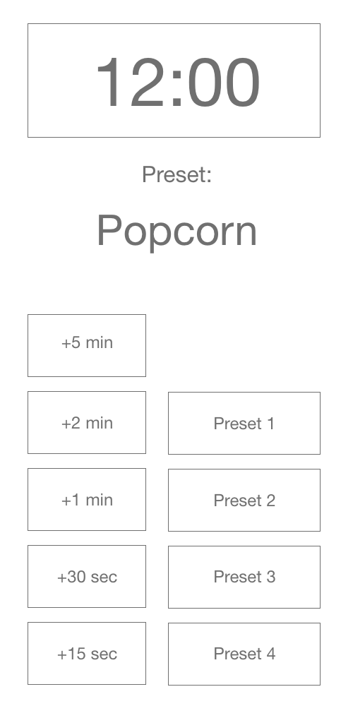

# HCI Microwave
by Ynigo Reyes

Link to Website: https://ynigoreyes.github.io/p1YnigoReyes/

Please run pde on your own to test app

## Common/Uncommon uses for a microwave
* Heating up leftover food
* Arts and Crafts
* Defrosting
* Heating up frozen/ready-to-eat meals

## User interaction
* Put food into microwave
* Close microwave door
* Either chose a time or preset
* Microwave will automatically turn on as soon as a button is pressed
* Wait for time to run out or add more time
* Microwave will shut off when door is opened

## Microwave Feedback
* Will beep when food is ready
* Safety precautions like automatic power on and off when closed and open

## Low Old Microwave

## Low Fidelity Screenshot

## Final Design

## Common mistakes with current microwave design
* Buttons are all over the place/not in a easy to read format
* Clock is too small
* No metal detector in microwave (not kid friendly)
* Hard to tell what is going on from a far

## How I solved these issues
* Screen turns green when the microwave is on, that way we know it is on even when we have headphones on
* I removed the stop/start button because that is really just one more button to press
* increased the size of the clock to make sure you can see it from afar
* Reorganized the buttons to be easy on the eyes. Made sure them thicker to make is easier to press
* The preset buttons are bigger so that they would be used more